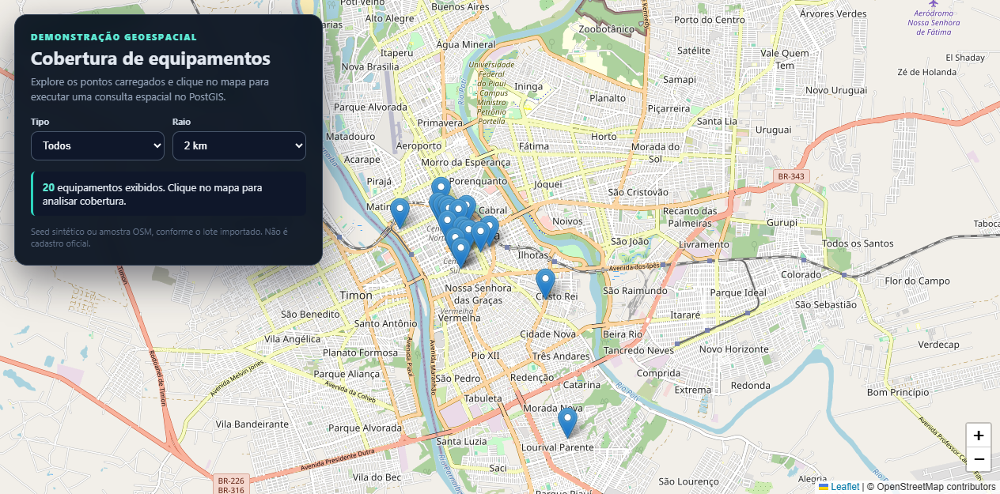
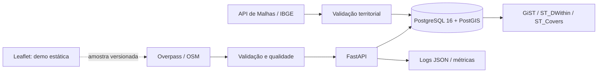

# Geo Intelligence API

[](https://github.com/endeson12/geo-intelligence-api/actions/workflows/ci.yml)
[](https://endeson12.github.io/geo-intelligence-api/)

API geoespacial demonstrativa para explorar proximidade, cobertura radial e presença de equipamentos em território oficial simplificado. Combina **FastAPI, PostgreSQL/PostGIS, GeoJSON, dados públicos com proveniência, Docker e CI**.

> Este é um projeto-vitrine: **não possui clientes, SLA, operação institucional nem métricas de produção**. A demonstração web é estática; a API e o PostGIS são executados separadamente na CI pública.

## Problema e decisão apoiada

Perguntas como “qual instalação está mais perto?”, “o que existe neste raio?” e “quais equipamentos estão dentro deste território?” precisam de semântica espacial explícita e dados rastreáveis. O projeto oferece contratos GeoJSON e registra as funções PostGIS usadas em cada análise.

## Experimente

- **Demonstração pública estática:** <https://endeson12.github.io/geo-intelligence-api/>
- **Vídeo de 18 segundos:** [visão geral do projeto](docs/geo-intelligence-overview.mp4)
- **Swagger local da API:** `http://localhost:8000/docs`
- **Evidência de execução:** [GitHub Actions](https://github.com/endeson12/geo-intelligence-api/actions)



A página pública usa a fotografia OSM versionada, o limite municipal simplificado do IBGE e cálculo Haversine no navegador. Ela permite avaliar a experiência sem fingir um backend hospedado. A implementação FastAPI/PostGIS equivalente é validada em PostgreSQL/PostGIS real na CI.

## Capacidades demonstradas

- importação GeoJSON autenticada, validada e transacional;
- **lotes persistentes, hash SHA-256 e reimportação idempotente**;
- catálogo de datasets e proveniência;
- filtros por tipo e `bbox`, proximidade e cobertura radial;
- consulta inclusiva de equipamentos dentro do território com `ST_Covers`;
- limite oficial simplificado do município de Teresina obtido da API do IBGE;
- amostra comunitária OSM com atribuição e relatório de qualidade;
- GiST para geometria e índice funcional GiST compatível com `geom::geography`;
- benchmark `EXPLAIN (ANALYZE, BUFFERS)` reproduzível e publicado como artefato da CI;
- Ruff, mypy, pytest, PostGIS real, `pip-audit`, SBOM CycloneDX, build da imagem e Trivy;
- mapa, logs JSON, request ID, Prometheus e health checks.

## Dados e proveniência

| Conjunto | Natureza | Uso | Limitação principal |
|---|---|---|---|
| `osm-teresina-health.geojson` | OpenStreetMap/ODbL | 20 equipamentos de saúde | amostra comunitária, não cadastro oficial |
| `ibge-teresina-boundary.geojson` | API de Malhas do IBGE | limite municipal em consulta `ST_Covers` | malha simplificada, não cadastral |
| `scripts/seed.py` | sintético | inicialização técnica | dados inventados, sem uso decisório |

Consulte [fontes, coleta, atribuição e limitações](docs/data-sources.md). O relatório versionado observou **20/20 feições OSM válidas e 0 duplicidades exatas**; isso não comprova completude, atualidade ou acurácia posicional.

## Arquitetura



Detalhes: [arquitetura](docs/architecture.md), [ADRs](docs/decisions/) e [runbook](docs/operations.md).

## Quickstart

Pré-requisitos: Docker com Compose. Troque as credenciais da cópia local do ambiente.

```bash
cp .env.example .env
docker compose up --build -d
docker compose exec api python scripts/import_territories.py data/ibge-teresina-boundary.geojson
docker compose exec api python scripts/seed.py
curl http://localhost:8000/health/ready
```

Importar a fotografia OSM incluída:

```bash
curl -fsS -X POST http://localhost:8000/api/v1/import/geojson \
  -H 'Content-Type: application/json' \
  -H 'X-API-Key: substitua-pela-chave-local' \
  --data-binary @data/osm-teresina-health.geojson
```

Acesse Swagger em `/docs`, mapa conectado à API em `/map` e métricas em `/metrics`.

## Endpoints

| Método | Rota | Finalidade |
|---|---|---|
| GET | `/health/live` | processo vivo |
| GET | `/health/ready` | banco alcançável |
| GET | `/api/v1/facilities?tipo=&bbox=xmin,ymin,xmax,ymax` | FeatureCollection filtrada |
| GET | `/api/v1/facilities/nearest?lat=&lon=&limit=&raio_m=` | vizinhos por distância geodésica |
| GET | `/api/v1/coverage?lat=&lon=&raio_m=&tipo=` | feições e resumo no raio |
| GET | `/api/v1/territories/2211001/coverage?tipo=` | polígono, proveniência e equipamentos cobertos |
| GET | `/api/v1/datasets` | lotes importados e metadados |
| POST | `/api/v1/import/geojson` | importação idempotente por hash, protegida por API key |

O import aceita `FeatureCollection` de `Point` em EPSG:4326 e no máximo 10 mil feições. Uma repetição byte-semântica do mesmo payload retorna `200`, `status=ja_importado` e não duplica registros. Lotes semanticamente diferentes ainda exigem uma política de reconciliação por identificador externo antes de uso institucional.

## Evidências reproduzíveis

```bash
uv sync --all-groups --frozen
uv run ruff check .
uv run ruff format --check .
uv run mypy
uv run pytest --cov=geo_intelligence_api
uv run pip-audit
uv run cyclonedx-py environment --output-reproducible --of JSON -o sbom.cdx.json
uv run alembic upgrade head
uv run python scripts/import_territories.py data/ibge-teresina-boundary.geojson
uv run python scripts/data_quality.py data/osm-teresina-health.geojson
uv run python scripts/benchmark_postgis.py --output benchmark-postgis.json
```

O benchmark usa 100 mil pontos sintéticos determinísticos em tabela temporária, executa a mesma consulta `ST_DWithin` antes e depois do índice funcional e registra plano, buffers, versões e tempos. É uma medição do ambiente efêmero da CI, **não uma promessa de desempenho de produção**.

## Segurança e governança

- SQL parametrizado, rollback, validação WGS84 e limite lógico de feições;
- API key é apenas controle demonstrativo; produção exigiria OIDC/RBAC e rotação;
- imagem não-root, filesystem somente leitura e `no-new-privileges` no Compose;
- `pip-audit`, SBOM CycloneDX e Trivy são evidências complementares, não garantia absoluta;
- proveniência acompanha lotes, territórios e equipamentos;
- dados pessoais e coordenadas sensíveis exigem base legal, minimização e avaliação LGPD.

Veja [SECURITY.md](SECURITY.md).

## Limitações honestas

- não existe backend público permanente; o Pages é uma demonstração estática;
- API key única, sem RBAC, quotas, WAF ou rate limiting;
- limite de 10 mil feições é lógico, não limite de bytes no proxy;
- cobertura radial não é isócrona viária;
- OSM pode estar incompleto e o limite do IBGE é simplificado;
- reimportação idêntica é idempotente, mas ainda não há upsert por identificador externo entre versões diferentes;
- benchmark e CI não equivalem a carga contínua ou produção institucional.

## Roadmap

1. upsert por identificador externo e política explícita de reconciliação entre versões;
2. OIDC/RBAC, rate limiting e limite de corpo no proxy;
3. setores/bairros com referência temporal e indicadores agregados;
4. isócronas de rede, importação assíncrona e OGC API Features;
5. SLOs somente após existir uma implantação real e observável.

## Licença

Código sob MIT. Dados preservam suas próprias atribuições e condições, descritas em [fontes](docs/data-sources.md). Contribuições seguem [CONTRIBUTING.md](CONTRIBUTING.md); versões estão no [CHANGELOG](CHANGELOG.md).
