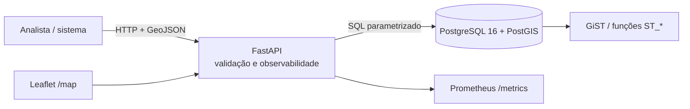

# Geo Intelligence API

API geoespacial de referência para equipes B2B/B2G explorarem acesso a equipamentos, proximidade e cobertura territorial com consultas auditáveis no PostGIS. O projeto é uma demonstração técnica: **não possui clientes nem métricas de produção**. O seed é sintético; uma amostra separada do OpenStreetMap demonstra ingestão com proveniência, sem ser apresentada como cadastro oficial.

## Problema

Decisões sobre saúde, educação, assistência e segurança frequentemente dependem de perguntas espaciais — “o que existe nesta área?”, “qual instalação está mais perto?” e “quantas estão cobertas por este raio?”. Esta API oferece contratos GeoJSON simples sem esconder a semântica espacial executada pelo banco.

## Arquitetura



- FastAPI/Pydantic: contrato e validação WGS84.
- SQLAlchemy 2/GeoAlchemy2: sessão transacional e tipo espacial.
- PostGIS: `ST_DWithin`, `ST_DistanceSphere`, envelope e índice GiST.
- Alembic: infraestrutura versionada, incluindo extensão PostGIS.

## Quickstart

Pré-requisitos: Docker com Compose. Copie `.env.example` para `.env` e troque senhas/chave.

```bash
cp .env.example .env
docker compose up --build -d
docker compose exec api python scripts/seed.py
curl http://localhost:8000/health/ready
```

Para importar a fotografia OpenStreetMap incluída, preservando a atribuição:

```bash
curl -fsS -X POST http://localhost:8000/api/v1/import/geojson \
  -H 'Content-Type: application/json' \
  -H "X-API-Key: $API_KEY" \
  --data-binary @data/osm-teresina-health.geojson
```

Acesse Swagger em `http://localhost:8000/docs`, mapa em `/map` e métricas em `/metrics`.
Para desenvolvimento local: `uv python install 3.12 && uv sync --all-groups`, configure PostgreSQL/PostGIS, rode `uv run alembic upgrade head` e `make test`.

## Endpoints

| Método | Rota | Finalidade |
|---|---|---|
| GET | `/health/live` | Processo vivo |
| GET | `/health/ready` | Banco alcançável |
| GET | `/api/v1/facilities?tipo=&bbox=xmin,ymin,xmax,ymax` | FeatureCollection filtrada |
| GET | `/api/v1/facilities/nearest?lat=&lon=&limit=&raio_m=` | Vizinhos por distância geodésica |
| GET | `/api/v1/coverage?lat=&lon=&raio_m=&tipo=` | Contagem no raio |
| POST | `/api/v1/import/geojson` | Importação atômica autenticada por `X-API-Key` |

O import aceita apenas `FeatureCollection` de `Point`, coordenadas EPSG:4326 e propriedades `nome`, `tipo`, `fonte`. Limite: 10 mil feições por requisição.

## Segurança, governança e LGPD

- A chave de API é um controle demonstrativo; em produção use OIDC, rotação e cofre de segredos.
- Importação é validada antes da gravação e consolidada em uma transação; falhas de banco causam rollback.
- Request ID propagado, logs JSON, métricas Prometheus e headers defensivos ajudam auditoria.
- A origem (`fonte`) acompanha cada registro. O seed é explicitamente sintético.
- A amostra OSM registra licença, timestamp da base e identificador de cada elemento; consulte [fontes e qualidade dos dados](docs/data-sources.md).
- Minimize dados pessoais e coordenadas sensíveis; defina base legal, retenção, controle de acesso e avaliação de impacto conforme LGPD. Esta aplicação não deve armazenar dados pessoais sem governança adicional.
- Tiles do mapa usam OpenStreetMap no navegador; avalie política de privacidade e provedor próprio antes de produção.

Veja [SECURITY.md](SECURITY.md) para reporte responsável.

## Evidências reproduzíveis

```bash
uv run ruff check .
uv run ruff format --check .
uv run mypy
uv run pytest --cov=geo_intelligence_api
uv run alembic upgrade head
uv run python scripts/fetch_osm.py --output data/osm-teresina-health.geojson
docker compose config
```

A CI executa qualidade, migração real em PostGIS e testes. Resultados locais devem ser reportados pelo executor; este README não declara métricas históricas.

## Limitações

- Paginação ainda limitada a 1.000 instalações na listagem.
- API key única, sem RBAC/quotas; cache e rate limiting não implementados.
- Cobertura radial é uma aproximação operacional, não isócrona viária.
- Mapa depende de CDN/tiles externos; seed é fictício e a amostra OSM pode ser incompleta ou desatualizada.
- Testes unitários usam sessão substituta; CI valida a migração contra PostGIS, mas uma suíte de integração espacial mais extensa é recomendada.

## Roadmap

1. Paginação cursor-based e filtros temporais.
2. OIDC/RBAC, rate limiting e trilha de auditoria persistente.
3. Isócronas de rede, importação assíncrona e catálogo de metadados.
4. Testes de propriedade espacial, SLOs e dashboards versionados.
5. OGC API Features e suporte a geometrias adicionais com políticas explícitas.

## Licença

MIT. Consulte [LICENSE](LICENSE). Contribuições seguem [CONTRIBUTING.md](CONTRIBUTING.md).
