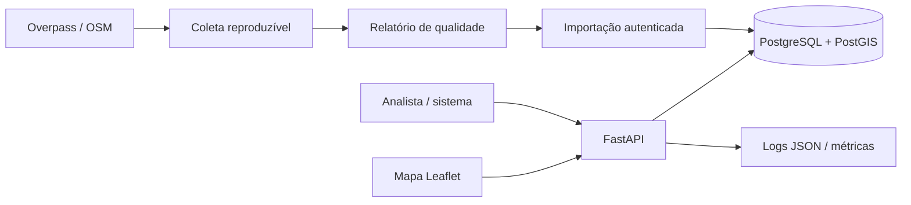

# Arquitetura

## Contexto

A aplicação demonstra uma API geoespacial B2B/B2G sem alegar operação institucional. O objetivo é tornar consultas territoriais reproduzíveis e auditáveis, separando ingestão, validação, persistência espacial e leitura.

## Componentes

## Fronteiras

- `scripts/`: coleta, validação e seed fora do tráfego HTTP;
- `src/geo_intelligence_api/api.py`: contratos e casos de uso HTTP;
- `database.py` e `models.py`: persistência e tipos espaciais;
- `migrations/`: extensão PostGIS, schema e índice GiST;
- `tests/`: contratos, falhas e integração PostGIS real na CI.

## Decisões

- [ADR 001 — PostgreSQL/PostGIS](decisions/001-postgis.md)
- [ADR 002 — CRS EPSG:4326](decisions/002-crs.md)
- [ADR 003 — importação atômica](decisions/003-import-atomicity.md)

## Limites deliberados

Monólito modular, API key única e cobertura radial são escolhas de demonstração. O uso institucional exige identidade federada, autorização granular, catálogo/versionamento de datasets, revisão de qualidade e operação com SLOs.
